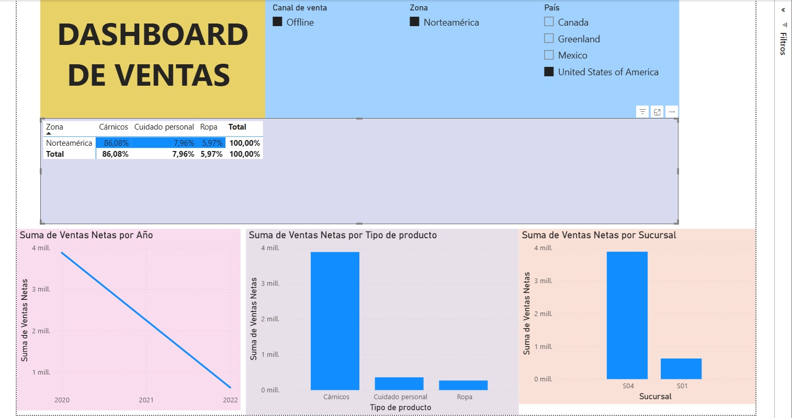

## Capturas del Dashboard

- Luego de seleccionar las etiquetas adecuadas. La imagen muestra el canal de venta dominante en los Estados Unidos, que vendría a ser el offline. Además de indicarnos que solo 3 productos son vendidos en dicho país, con los productos cárnicos tomando un 86% del total de ventas. La gráfica también nos muestra que las ventas en este país han decaido en los ultimos años. Esto nos indica que debemos tomar acciones y crear campañas para promocionar dichos productos, así como mejoras en el servicio de ventas, ya que el servicio de ventas tradicional, ha demostrado no ser adecuado, lo que pudo ser una causa en la caída de los ingresos hasta un 90% en la actualidad. 

